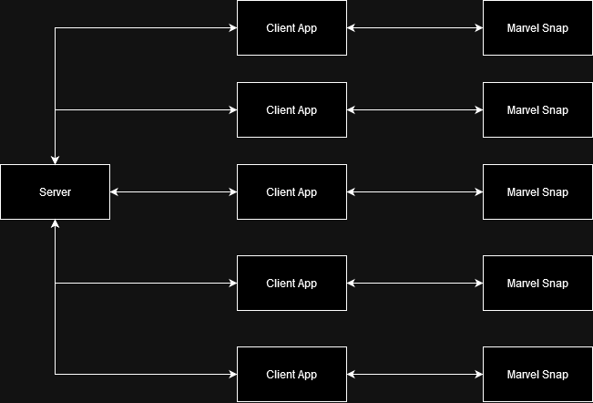

# Marvel Snap AI

## Notes

Create Server that contains all the AI calculation logic and can be deployed seperately from the clients. This allows multi client training which will speed up the AI development.

Client will work with reading the current state of the board, hot encode it and pass it to the server for prediction

## Design

At a high level multiple clients should be deployed each interacting with it's own marvel snap client and having it's own account. High Level design shown below

For the initial release the target will be 5 clients and 1 server module. As card's are hard to come by the first training model will only use cards in the first 2 sets as they are garunteed to be obtained. As the AI plays more and claiming rewards are completed more deck archetypes can be added.

This will also ensure that the model's being trianed and can share the brain as each deck will need to be a seperate model as the approach to the game will be different. A good idea would be to keep a base model as the starting point to ensure that each model doesn't have to be trained from scratch. Potentially after 1 week would be a good stopping point but this it TBD

A lower level design picture will be included once more decision have been made for how each component will actually work

### Client TBD after experimenting

There are two main points the need to be decided how will the client read the game state from the application and how will it perform actions against the client. I have broken this into two different sections and discussing them seperately as there are many options for both.

#### Reading State

I see two main options here for reading state:
- Read from log file
- Read from memory

Reading from the log file seems like the Marvel Snap approved way of getting information about the state, as decisions are not very time sensitive if there is a delay in when the log file this seems suitable. Marvel Snap Pro tracker has information on where the  [Log Location](https://marvelsnap.pro/marvel-snap-tracker/) can be found.

Reading from memory is another option more information would be available if doing it this way but the setup time will be considerably longer. At this stage I don't see any value from doing this as after testing the client seems to have very similiar information in memory than what is in the log file. This can be revisited at a later stage if the log is lacking some required data that will help the model prediction

At this stage the selection is read from the log file

#### Interacting with Client

I see two main options here for interacting with the client:
- Write to memory by calling local functions
- Send packets with required actions
- OCR but I hate that

Writing to memory will take a large amount of testing to come up with the required functions to make this work. It is also much more likely to be impacted by Marvel Snap making changes to thier application. I am hesitant to take this approach.

Sniff packets using wire shark and determine and then create custom packets to send to the server to take the required actions. As the marvel snap applications sends minimal data I believe this is going to be easier to setup and the requied packets being sent are much less likely to change. Unfortuately Marvel Snap uses TCP connection and uses TLS to encrypt these packets so that is looking like it's not possible.

At this stage sending packets is the best optiona.

### Server TBD after experimenting

Hot encoding will need be designed to pass the required state to the server and get an output back. At this stage going with a Multi Client gym implementation as it supports sending data over TCP, as turn timer is long the added overhead for the packets is not a concern as each turn has up to 20 - 40 seconds to act.

Need to ensure that there is a limit on how long the server can take to respond to ensure that the turn's are not missed even if the action is not great.

Action Items:
- Define reward for winning losing
- Decide if a custom reward structure is required for each action to ensure it learns at the start
- Should action masking be used [link](https://costa.sh/blog-a-closer-look-at-invalid-action-masking-in-policy-gradient-algorithms.html)`C:\Users\<username>\AppData\LocalLow\Second Dinner\SNAP\Standalone\States\nvprod`
- Define schema for hot encoding and how it will interpret it
- Define schema for the return values to tell the client what actions to take
